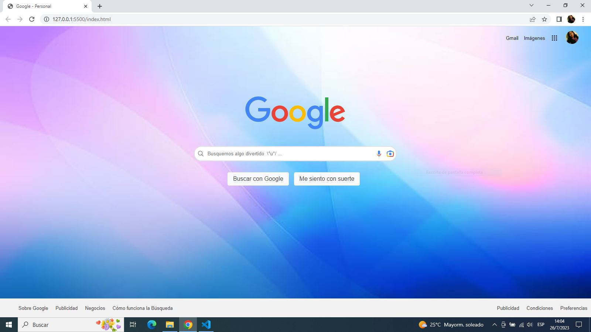

# ClonGoogle
Clon de página web Google

¿Este proyecto? Introducción.
  
Clonación de la interfaz de Google utilizando principalmente **HTML** y **CSS**.

¿Este proyecto es útil?

Los lenguajes de HTML y CSS permiten crear páginas web con diferentes elementos visuales, como cajas para entrada de texto, imágenes, encabezados, pies de página, etc.

Este proyecto se desarrolló con el objetivo de ampliar los conocimientos y aplicaciones de los lenguajes Html y Css en la creación de páginas web, empleando **Visual Studio Code** como entorno de desarrollo. Pretende inspirar a otros programadores y programadoras que deseen incursionar en **Frontend** con un ejemplo práctico.

¿Cómo comenzar con el proyecto?

Es recomendable iniciar identificando y explorando las partes principales que integran la página, que son:

- ** Header.** Contenido introductorio de la página web.
- ** Body.** Contenido principal de la página web.
- ** Footer.** Contenido al final de la página web.

Además de introducir el uso de las siguientes herramientas:

- ** Nav.** Sección cuyo propósito es proporcionar enlaces de navegación.
- ** Main.** Contenido principal de un documento o aplicación.

Empleamos el uso de cajas para introducción de texto, uso de iconos, direcciones globales de imágenes, botones, listas y demás, que fueron muy importantes para lograr la apariencia deseada. 

¿Quién mantiene y contribuye con el proyecto?

**Tecnolochicas** ha contribuido para el desarrollo de este proyecto, aportando los conocimientos básicos en Html y Css para su creación.

[Tecnolochicas](https://tecnolochicas.mx/).

¿Beneficios y desventajas de las herramientas utilizamos?

Las herramientas que nos proporciona Html y Css tienen diversas aplicaciones, son lenguajes relativamente sencillos de aprender, existe documentación de estos en diferentes medios que benefician el desarrollo web.

Vistas previas.

.
[Vista en navegador](https://clongoogle-cantarell.netlify.app/).

